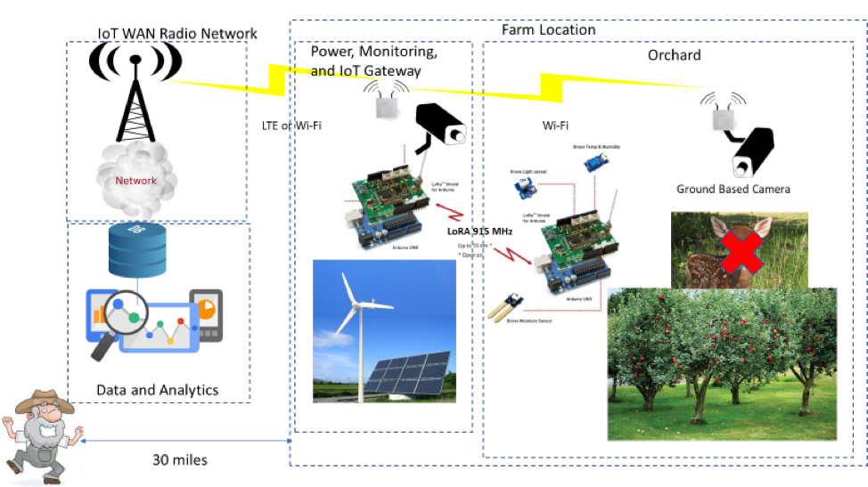

# Compare LoRa and APRS for Smart Farm

## 1. About
- It is a program that predicts a body fat percentage with simple body data using machine learning.

## 2. Environment
> |Network|Transmitted Power|Transmitter Antenna Height|Receiver Antenna Height|Transmitter Antenna Gain|Receiver Antenna Gain|EIRP|
> |---|---|---|---|---|---|---|
> |LoRa|16dBm|9dbi|6dBi|2.35m|4.0m|25dBm|
> |APRS|24dBm|1.71dBi|6dBi|2.35m|6.4m|25.17dBm|

## 3. Installation
- GNU Radio 
    - https://wiki.gnuradio.org/index.php/Guided_Tutorial_GNU_Radio_in_Python

- xgboost 
    - !pip install xgboost 
    - !brew install libomp
- lightgbm 
    - !pip install lightgbm

## 4. Data
- format: .csv 
- distribution  
> |Data|Numbers|Ratio|
> |---|---|---|
> |train|684|0.8|
> |test|169|0.2|
> |total|853|1| 
- example 
> |Index|Age|Sex|Volt|Height|Weight|Standard_Weight|Body_Fat_Rate|
> |---|---|---|---|---|---|---|---|
> |0|23|0|1.35|167|62.8|60.3|31.9
> |1|20|1|1.15|183|75.1|74.7|12.6

## 5. Results
- LoRa is more feasible than APRS for the networking technology in smart farms without considerable investments in towers and/or repeaters. 
> |Network|Distance|Efficiency constrained by Height|
> |---|---|---|
> |LoRa|4.2km|45.16%|
> |APRS|0.84km|1.44%|

## 6. Run on the Web
- download files
    - web/templates/index.html
    - web/templates/predict.html
- make the 'model.pkl' file
    - python3 web/make_pkl.py
- run the server
    - python3 web/app.py
- access to the web
    - localhost:5000
- Screenshots
    
    
    

# AgIoT_LoRa_vs_APRS
CIT 581 IoT Fall 2019

Semester project overview: Build a system to monitor a remote power generation station (solar and wind) and orchard for a “farmer” who lives 30 miles away.

Background: Agricultural IoT is one of the most promising and potentially important areas of the IoT market.  It is also an excellent way to study the IoT ecosystem while making important contributions to a field of research that is critical to our world; food and raw materials production.  Purdue’s CIT Department has had several successful projects in this area, and there are numerous companies and organizations in Central Indiana (such as WHIN) putting large amount of resources into Ag IoT systems.  

Project specifics: Our scenario will be that of a small orchard located about 30 miles from the “farmer”, who needs to monitor and receive pertinent data regarding fruit production, as well as monitoring the available alternative energy sources used to power irrigation, lighting and the IoT systems used for the project. The plan is to build an IoT system for a “Micro-Farm of the Future”.  Emphasis will be placed on the user interface and analytics that can quickly update the farmer on specific information that he needs to manage the farm and systems.  The specific sectors and topics that will be explored are as follows:
1.	Soil conditions:  The mainstay of farming, being able to get important information about moisture, temperature, pH, and other factors over a large geographic area is critical to successful yields.
2.	Weather information:  As important as soil conditions, weather information and outlook can make or break a year’s harvest.
3.	Alternative energy:  Many areas of agricultural land in the U.S. do not have easy access to electrical power.  An alternate power supply consisting of solar panels and a wind generator has already been built, but ways of monitoring key elements of the station for providing electrical power to irrigation, lighting as well as IoT and network equipment will need to be implemented.
4.	Radio Networks:  There are numerous LPWAN, as well as higher throughput networks (such as LTE), that we will need to evaluate and implement.  A parallel project with a group of students from the IITP sponsored program at the K-SW Square using the amateur radio (HAM) APRS frequencies as a no-cost network backbone will continue to be tested.
5.	Security:  Both Physical and Cyber Security systems must be considered. Of priority for the farmer is monitoring power and technology resources, implementing means of loss prevention, as well as pest and varmint detection and deterrence.

For Next Wednesday:
You are a small IoT integration company that is interested in completing the above described system for Farmer Smith, and if successful, possibly commercializing the system as a turn-key for other small farms. You have an interview with the customer Wednesday the 28th during the scheduled CIT 581 IoT class period.  What would you need to know if you were a vendor trying to put together a solution for this customer and have an acceptable ROI on the project?  Put together a list of questions to ask during the interview.

